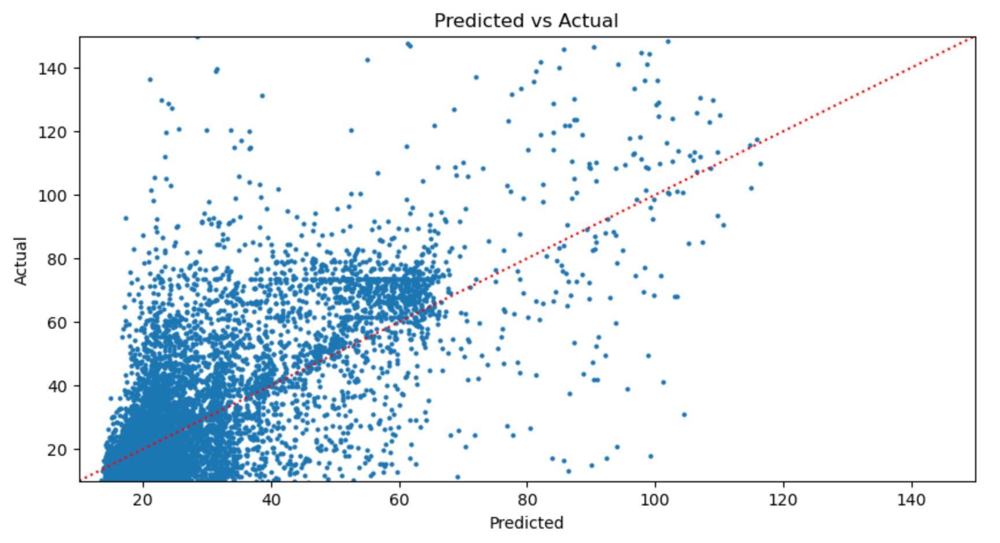

# New York Taxi Analysis

## Project Overview 

This project involves exploring and modeling the dataset of taxi trips collected by the New York City Taxi and Limousine Commission (TLC). predicts the average money spent on taxi rides per given day and hour. This dataset contains millions of trip records, including details such as pickup and drop-off times, locations, fares, distances, and passenger counts for just January 2020. The project aims to extract insights, understand travel patterns, and build predictive models using machine learning techniques.

The main objective after exploring the data was to predict average money spent for each region of New York per given day and hour. 

Here is the [data](https://www.nyc.gov/site/tlc/about/tlc-trip-record-data.page) used as well as the [data dictionary](https://www.nyc.gov/assets/tlc/downloads/pdf/data_dictionary_trip_records_yellow.pdf). 

This project was guided by [Misra Turp's Hands On Data Science Course](https://www.youtube.com/playlist?list=PLM8lYG2MzHmTgsYKLJtdKwf6tHVbui9eE).

## Data Cleaning
1. Removed total amounts that were negative, $0 or outliers (very high) as they most likely mean refunds or disputes or data entered incorrectly. 
2. Removed taxi rides from FlexFare where payment is decided up front as this isn't relevant to our problem statement. This is only 1% of the data.
3. Corrected datatypes to their proper type and separated datetime column into 5 separate columns (Date, Year, Month, Day, Hour). Removed data that isn't coded into January 2020. 
4. Aggregate column to get average rate per given hour and region. This will be a better way to predict hourly income for taxi driver

## Benchmark Model
Here is a list of features included in benchmark model. 
['PULocationID', 'Month', 'Day', 'Hour', 'trip_distance',
       'countOfTransactions']

 The mean total amount is the target variable.

 A Decision Tree regressor model was used as our benchmark model. The scores are very good with a R2 value of 0.69. I suspect that the model may be overfit becuase the trip distance is very coorelated to the hourly rate so in future models I will remove as this would not be a known variable for Taxi Drivers. 

## Feature Engineering
3 new variables were created
1. A binary variable of whether it's a weekend or not
2. A binary variable of whether it's a holiday or not
3. From the Location ID, there is a higher level categorization of regions called Boroughs which came from the TLC website. This information was merged in. 
4. Lastly, I found a NYC [weather data](https://www.kaggle.com/datasets/aadimator/nyc-weather-2016-to-2022?resource=download) from January 2020 broken down by hour. The following information was merged into our dataset: Temperature, Precipitation, Cloud Cover, Windspeed. 

## Model Algorithm Results
I created the following algorithms with our new features and here are the results:

| Algorithm         | RMSE  | R2   |
|-------------------|-------|------|
| Benchmark         | 16.16 | 0.29 |
| Decision Tree     | 15.44 | 0.36 |
| Random Forest     | 13.88 | 0.48 |
| Gradient Boosting | 14.09 | 0.46 |

The Random Forest Algorithm was selected to be finetuned. 

These are the best parameter values:
n_estimators= 150,
max_features= 'sqrt'
max_depth= 40
min_samples_split= 40
min_samples_leaf=4
bootstrap= False)

Results of the tuned Algorithm: 
| Algorithm | RMSE  | R2   |
|-----------|-------|------|
| Untuned   | 13.88 | 0.48 |
| Tuned     | 13.3  | 0.52 |

## Conclusion
Our model metrics tell us that our predictions are on average $13.00 off from the actual hourly rate. The model only explains 52% of the date. These results are just okay and could be improved. 

## Next steps
Some potential next steps include the following
- Precicting rates based on ALL of NYC could be too vast. One way to improve accuracy is to filter the data to predict only in the top few boroughs as maybe the less popular boroughs are not accurate predictions. 
- Use K-means to identify popular pickup/drop off hotspots and encode these as clusters
- Add other months into the dataset

